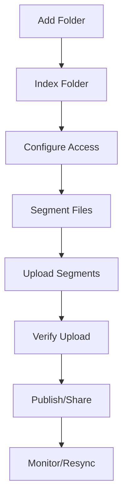

# Folder Management Architecture for UsenetSync

## Overview
The correct approach is **Folder-Based Management**, not file-based uploads. This provides granular control, better organization, and scalable handling of large datasets.

## Folder Lifecycle



## 1. Folder Management Page Structure

### Main Components:

```
┌─────────────────────────────────────────────────────────────┐
│ Folder Management                                           │
├─────────────────────────────────────────────────────────────┤
│ ┌─────────────┐  ┌──────────────────────────────────────┐ │
│ │ Folder List │  │ Folder Details                       │ │
│ │             │  ├──────────────────────────────────────┤ │
│ │ + Add       │  │ [Overview] [Access] [Files] [Actions]│ │
│ │             │  │                                      │ │
│ │ ▼ Folder 1  │  │ Current Tab Content...               │ │
│ │   Folder 2  │  │                                      │ │
│ │   Folder 3  │  │                                      │ │
│ └─────────────┘  └──────────────────────────────────────┘ │
└─────────────────────────────────────────────────────────────┘
```

## 2. Folder States

### A. Folder Lifecycle States
```typescript
enum FolderState {
  ADDED = 'added',           // Folder added but not indexed
  INDEXING = 'indexing',     // Currently scanning files
  INDEXED = 'indexed',       // Files discovered, not segmented
  SEGMENTING = 'segmenting', // Creating segments
  SEGMENTED = 'segmented',   // Ready for upload
  UPLOADING = 'uploading',   // Upload in progress
  UPLOADED = 'uploaded',     // All segments uploaded
  PUBLISHED = 'published',   // Share links generated
  ERROR = 'error',          // Error state
  RESYNCING = 'resyncing'   // Checking for changes
}
```

### B. Folder Data Model
```typescript
interface ManagedFolder {
  id: string;
  path: string;
  name: string;
  state: FolderState;
  
  // Statistics
  stats: {
    totalFiles: number;
    totalFolders: number;
    totalSize: number;
    indexedFiles: number;
    segmentCount: number;
    uploadedSegments: number;
  };
  
  // Access Control
  access: {
    type: 'public' | 'private' | 'protected';
    password?: string;
    allowedUsers: string[];
    expiresAt?: Date;
    maxDownloads?: number;
  };
  
  // Progress
  progress: {
    indexing: number;    // 0-100
    segmenting: number;  // 0-100
    uploading: number;   // 0-100
    currentFile?: string;
    speed?: number;
    eta?: number;
  };
  
  // Metadata
  createdAt: Date;
  lastIndexed?: Date;
  lastUploaded?: Date;
  lastModified?: Date;
  shareId?: string;
}
```

## 3. Tab Functionality

### A. Overview Tab
```typescript
interface OverviewTab {
  // Display
  - Folder path
  - Current state with visual indicator
  - Statistics dashboard
  - Progress bars for active operations
  - Recent activity log
  
  // Actions
  - Start/Stop indexing
  - Pause/Resume operations
  - Delete folder
}
```

**Visual Example:**
```
┌─ Overview ──────────────────────────────────────────┐
│ Path: /media/storage/movies                        │
│ State: [●] Uploading (67%)                        │
│                                                    │
│ ┌─ Statistics ─────────────────────────────────┐  │
│ │ Files:      12,456  Uploaded:    8,344       │  │
│ │ Folders:    1,234   Segments:    45,234      │  │
│ │ Total Size: 4.5 TB  Uploaded:    3.0 TB      │  │
│ └───────────────────────────────────────────────┘  │
│                                                    │
│ ┌─ Progress ───────────────────────────────────┐  │
│ │ Indexing:    [████████████████████] 100%     │  │
│ │ Segmenting:  [████████████████████] 100%     │  │
│ │ Uploading:   [████████████░░░░░░░░] 67%      │  │
│ │ Current: movie_file_8344.mkv                  │  │
│ │ Speed: 45 MB/s | ETA: 2h 34m                  │  │
│ └───────────────────────────────────────────────┘  │
└────────────────────────────────────────────────────┘
```

### B. Access Control Tab
```typescript
interface AccessControlTab {
  // Settings
  - Access type selector (public/private/protected)
  - Password management
  - User whitelist/blacklist
  - Expiration settings
  - Download limits
  
  // Share Management
  - Generate share links
  - Revoke access
  - View access logs
  - Set bandwidth limits per user
}
```

**Visual Example:**
```
┌─ Access Control ────────────────────────────────────┐
│ Access Type: [●] Public [ ] Private [ ] Protected  │
│                                                    │
│ Share Settings:                                    │
│ ┌──────────────────────────────────────────────┐  │
│ │ Max Downloads: [100    ] (empty = unlimited) │  │
│ │ Expires: [2024-12-31] [23:59]               │  │
│ │ Bandwidth Limit: [10] MB/s per user         │  │
│ └──────────────────────────────────────────────┘  │
│                                                    │
│ Allowed Users:                                     │
│ ┌──────────────────────────────────────────────┐  │
│ │ user1@example.com              [Remove]     │  │
│ │ user2@example.com              [Remove]     │  │
│ │ [Add User...                 ] [Add]        │  │
│ └──────────────────────────────────────────────┘  │
│                                                    │
│ Share Link:                                        │
│ [usenetsync://share/ABCD1234...] [Copy] [QR]     │
└────────────────────────────────────────────────────┘
```

### C. Files & Segments Tab
```typescript
interface FilesSegmentsTab {
  // File Browser
  - Tree view of indexed files
  - File status indicators
  - Segment information per file
  
  // Segment Management
  - View segment details
  - Retry failed segments
  - Verify segment integrity
  - View Message-IDs
  
  // Upload Control
  - Priority settings
  - Selective file upload
  - Segment verification status
}
```

**Visual Example:**
```
┌─ Files & Segments ──────────────────────────────────┐
│ [Search...                    ] [✓ Show uploaded]  │
│                                                    │
│ ┌──────────────────────────────────────────────┐  │
│ │ ▼ 📁 movies/                                  │  │
│ │   ▼ 📁 action/                               │  │
│ │     ✅ movie1.mkv (2.1 GB, 2,734 segments)  │  │
│ │     ⏳ movie2.mkv (1.8 GB, 67% uploaded)    │  │
│ │     ❌ movie3.mkv (2.3 GB, retry needed)    │  │
│ │   ▶ 📁 comedy/                               │  │
│ └──────────────────────────────────────────────┘  │
│                                                    │
│ Selected: movie2.mkv                               │
│ ┌─ Segment Details ────────────────────────────┐  │
│ │ Total Segments: 2,345                        │  │
│ │ Uploaded: 1,571 (67%)                        │  │
│ │ Failed: 3                                    │  │
│ │ Size per segment: 768 KB                     │  │
│ │                                              │  │
│ │ [Retry Failed] [Verify All] [View Headers]   │  │
│ └──────────────────────────────────────────────┘  │
└────────────────────────────────────────────────────┘
```

### D. Actions Tab
```typescript
interface ActionsTab {
  // Maintenance
  - Re-index folder (check for changes)
  - Re-sync (upload missing segments)
  - Verify integrity
  - Repair with PAR2
  
  // Publishing
  - Publish to indexers
  - Generate NZB file
  - Create torrent
  
  // Advanced
  - Change newsgroup
  - Repost with different settings
  - Archive folder
  - Export metadata
}
```

## 4. Backend Operations

### A. Folder Operations Flow
```python
class FolderManager:
    def add_folder(self, path: str) -> Folder:
        """Add folder to management system"""
        # 1. Validate path exists
        # 2. Check not duplicate
        # 3. Create folder record
        # 4. Return folder object
        
    def index_folder(self, folder_id: str):
        """Index folder contents"""
        # 1. Start background job
        # 2. Walk directory tree
        # 3. Chunk processing (1000 files at a time)
        # 4. Stream progress updates
        # 5. Store in database
        
    def segment_folder(self, folder_id: str):
        """Create segments for all files"""
        # 1. Load indexed files
        # 2. Process each file:
        #    - Read in chunks
        #    - Create 768KB segments
        #    - Calculate hashes
        #    - Generate PAR2
        # 3. Store segment metadata
        
    def upload_folder(self, folder_id: str):
        """Upload all segments to Usenet"""
        # 1. Create upload session
        # 2. Queue all segments
        # 3. Start worker pool
        # 4. Post to Usenet
        # 5. Track progress
        # 6. Handle retries
```

### B. Progress Streaming
```python
class ProgressStreamer:
    def __init__(self, websocket):
        self.websocket = websocket
        self.folders = {}
        
    def update_progress(self, folder_id: str, operation: str, progress: float):
        """Stream progress update to frontend"""
        self.websocket.send({
            'type': 'folder_progress',
            'folder_id': folder_id,
            'operation': operation,  # indexing|segmenting|uploading
            'progress': progress,
            'timestamp': datetime.now()
        })
```

## 5. Handling Large Folders (20TB Example)

### A. Chunked Processing Strategy
```python
def process_large_folder(folder_path: str, chunk_size: int = 1000):
    """Process large folder in chunks"""
    
    # Phase 1: Discovery (lightweight)
    total_files = 0
    for root, dirs, files in os.walk(folder_path):
        total_files += len(files)
        if total_files % chunk_size == 0:
            yield {'phase': 'discovery', 'count': total_files}
    
    # Phase 2: Chunked Indexing
    file_buffer = []
    for root, dirs, files in os.walk(folder_path):
        for file in files:
            file_buffer.append(os.path.join(root, file))
            if len(file_buffer) >= chunk_size:
                process_chunk(file_buffer)
                file_buffer = []
                yield {'phase': 'indexing', 'processed': processed_count}
    
    # Phase 3: Parallel Segmentation
    with ThreadPoolExecutor(max_workers=10) as executor:
        # Process files in parallel
        futures = []
        for file_batch in get_file_batches(indexed_files, 100):
            future = executor.submit(segment_files, file_batch)
            futures.append(future)
```

### B. Resource Management
```python
class ResourceManager:
    """Manage system resources for large operations"""
    
    def __init__(self):
        self.max_memory = 4 * 1024 * 1024 * 1024  # 4GB
        self.max_threads = 10
        self.max_connections = 20
        
    def can_process_file(self, file_size: int) -> bool:
        """Check if we have resources to process file"""
        current_memory = psutil.Process().memory_info().rss
        return (current_memory + file_size) < self.max_memory
        
    def throttle_if_needed(self):
        """Throttle operations if system is under pressure"""
        cpu_percent = psutil.cpu_percent(interval=1)
        if cpu_percent > 80:
            time.sleep(1)  # Brief pause
```

## 6. Database Schema for Folders

```sql
-- Folders table
CREATE TABLE folders (
    id UUID PRIMARY KEY,
    path TEXT NOT NULL UNIQUE,
    name TEXT NOT NULL,
    state VARCHAR(20) NOT NULL,
    total_files INTEGER DEFAULT 0,
    total_folders INTEGER DEFAULT 0,
    total_size BIGINT DEFAULT 0,
    indexed_files INTEGER DEFAULT 0,
    segment_count INTEGER DEFAULT 0,
    uploaded_segments INTEGER DEFAULT 0,
    created_at TIMESTAMP NOT NULL,
    last_indexed TIMESTAMP,
    last_uploaded TIMESTAMP,
    last_modified TIMESTAMP,
    share_id TEXT,
    access_type VARCHAR(20) DEFAULT 'public',
    password_hash TEXT,
    metadata JSONB
);

-- Folder files table
CREATE TABLE folder_files (
    id UUID PRIMARY KEY,
    folder_id UUID REFERENCES folders(id),
    file_path TEXT NOT NULL,
    file_name TEXT NOT NULL,
    file_size BIGINT,
    file_hash TEXT,
    segment_count INTEGER DEFAULT 0,
    uploaded_segments INTEGER DEFAULT 0,
    state VARCHAR(20),
    created_at TIMESTAMP,
    uploaded_at TIMESTAMP,
    metadata JSONB
);

-- Segments table
CREATE TABLE segments (
    id UUID PRIMARY KEY,
    file_id UUID REFERENCES folder_files(id),
    segment_index INTEGER NOT NULL,
    segment_size INTEGER,
    segment_hash TEXT,
    message_id TEXT,
    newsgroup TEXT,
    uploaded_at TIMESTAMP,
    retry_count INTEGER DEFAULT 0,
    state VARCHAR(20),
    UNIQUE(file_id, segment_index)
);

-- Folder access table
CREATE TABLE folder_access (
    id UUID PRIMARY KEY,
    folder_id UUID REFERENCES folders(id),
    user_email TEXT,
    access_type VARCHAR(20),
    max_downloads INTEGER,
    expires_at TIMESTAMP,
    created_at TIMESTAMP
);
```

## 7. UI Components Needed

### A. FolderList Component
```typescript
interface FolderListProps {
  folders: ManagedFolder[];
  selectedFolder: string | null;
  onSelectFolder: (folderId: string) => void;
  onAddFolder: () => void;
}
```

### B. FolderDetails Component
```typescript
interface FolderDetailsProps {
  folder: ManagedFolder;
  activeTab: 'overview' | 'access' | 'files' | 'actions';
  onTabChange: (tab: string) => void;
}
```

### C. ProgressIndicator Component
```typescript
interface ProgressIndicatorProps {
  operation: 'indexing' | 'segmenting' | 'uploading';
  progress: number;
  currentFile?: string;
  speed?: number;
  eta?: number;
}
```

## 8. Implementation Priority

### Phase 1: Core Folder Management
1. Add/Remove folders
2. Basic indexing
3. Folder state tracking
4. Overview tab

### Phase 2: Processing
1. Segmentation system
2. Upload queue
3. Progress tracking
4. Files & Segments tab

### Phase 3: Access Control
1. Access type management
2. User permissions
3. Share generation
4. Access Control tab

### Phase 4: Advanced Features
1. Re-sync capability
2. PAR2 verification
3. Selective upload
4. Actions tab

## Summary

The Folder Management approach provides:
- **Granular Control**: Manage each folder independently
- **Scalability**: Handle 20TB+ folders through chunking
- **Progress Visibility**: Real-time updates for all operations
- **State Management**: Clear lifecycle from added → published
- **Access Control**: Per-folder permissions and sharing
- **Resumability**: Pause/resume at any stage
- **Verification**: Ensure integrity before publishing

This is the correct architecture for a production Usenet sync system.